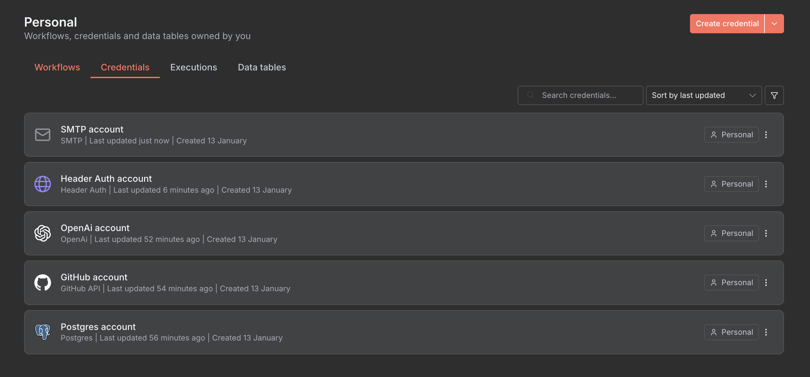

# n8n Workflows for Repository Automation

This directory contains n8n workflow configurations for automating repository ingestion and enrichment.

## Quick Setup

1. **Set up API Key in n8n:**

   - Go to Settings > Credentials
   - Create new "Generic Credential"
   - Name: "Spy API Key"
   - Add field: `apiKey` = `your-api-secret-key`

   

   **Important**: Make sure to use the exact field name `apiKey` as shown in the screenshot above. The workflows are configured to look for this specific credential field name.

2. **Import Workflows:**
   - Copy the JSON from each workflow file
   - In n8n: Workflows > Import from JSON
   - Paste the JSON and save
   - Update the domain URLs to match your deployment
   - Set credential to "Spy API Key"
   - Activate the workflow

## Workflows

### 1. `repository-ingestion-hourly.json`

- **Schedule**: Every 1 hour
- **Purpose**: Process new repositories from GitHub
- **Endpoint**: `POST /api/automation/ingest`

### 2. `repository-enrichment-5min.json`

- **Schedule**: Every 5 minutes
- **Purpose**: Enrich repositories with AI-generated content
- **Endpoint**: `POST /api/automation/enrich`
- **Smart**: Only runs if repositories need enrichment

### 3. `health-monitor-15min.json`

- **Schedule**: Every 15 minutes
- **Purpose**: Monitor system health
- **Endpoint**: `GET /api/automation/health`
- **Alerts**: Sends notifications if system is unhealthy

## Configuration

Before importing, update these values in each workflow:

1. **Domain URL**: Replace `https://yourdomain.com` with your actual domain
2. **Credential**: Set to "Spy API Key" (or your credential name)
3. **Notifications**: Configure notification nodes (email, Slack, etc.)

### Credential Setup Details

The workflows expect a Generic Credential with the following configuration:

- **Credential Name**: "Spy API Key" (or update workflow references)
- **Field Name**: `apiKey` (exactly as shown)
- **Field Value**: Your `API_SECRET_KEY` from the .env file

You can see the correct setup in the credentials screenshot above. The credential will be used in HTTP Request nodes with the header `X-API-Key`.

## Testing

Test the automation endpoints manually:

```bash
# Test from command line
curl -X GET "https://yourdomain.com/api/automation/health" \
  -H "X-API-Key: your-api-key"
```

## Monitoring

The workflows include basic success/error handling. For production:

1. **Add notification nodes** (email, Slack, Discord)
2. **Set up error handling** with retry logic
3. **Monitor execution logs** in n8n
4. **Set up alerts** for failed executions

## Customization

You can modify the workflows to:

- Change execution schedules
- Add custom notification channels
- Implement retry logic
- Add conditional execution based on system load
- Include custom preprocessing steps
